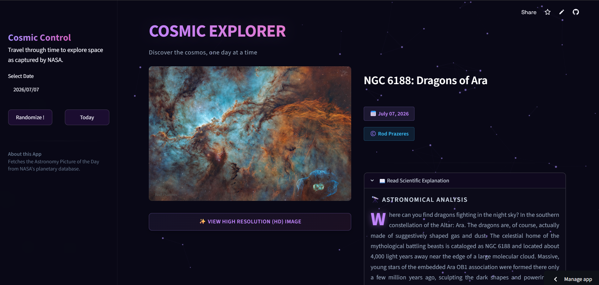
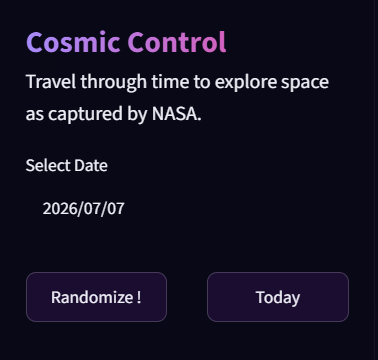

<div align="center">

# 🌌 Cosmic Explorer

### Discover the Cosmos, One Day at a Time

An immersive astronomy explorer built with **Python**, **Streamlit**, **JavaScript**, and **Custom CSS**, powered by NASA's Astronomy Picture of the Day (APOD) API.

<p align="center">

[](https://nasa-cosmic-explorer.streamlit.app/)


</p>

### 🚀 Live Demo

## https://nasa-cosmic-explorer.streamlit.app/

</div>

---

# 🌟 Features

- 🌌 Explore NASA's Astronomy Picture of the Day archive
- 📅 Browse any date from **June 16, 1995** to today
- 🎲 Random astronomy image generator
- 📆 Jump instantly to today's APOD
- 🖼️ Supports both images and videos
- 📷 View High Resolution (HD) images
- 📖 Read NASA's official scientific explanation
- ⚡ Fast loading using Streamlit caching
- 🎨 Modern glassmorphism-inspired interface
- 🌠 Fully customized Streamlit UI
- 🖱️ Interactive JavaScript enhancements
- 🔒 Secure API key management with Streamlit Secrets

---

# 📸 Preview

## 🏠 Home Dashboard

<p align="center">

</p>

---

## 🎲 Random Discovery & 📖 Scientific Explanation

<p align="center">


</p>

---

# 🛠 Tech Stack

| Technology | Purpose |
|------------|---------|
| Python | Backend |
| Streamlit | Web Framework |
| Requests | REST API |
| NASA APOD API | Astronomy Data |
| HTML | Custom Components |
| CSS | Modern UI Styling |
| JavaScript | Interactive Effects |

---

# 📂 Project Structure

```text
Cosmic-Explorer/
│
├── assets/
│   ├── home.png
│   ├── random.png
│   └── explanation.png
│
├── .streamlit/
│   └── secrets.toml
│
├── main.py
├── script.js
├── style.css
├── requirements.txt
├── README.md
└── .gitignore
```

---

# 🚀 Installation

Clone the repository

```bash
git clone https://github.com/SanjitGanesh/NASA-APOD.git
```

Navigate into the project

```bash
cd NASA-APOD
```

Create a virtual environment

```bash
python -m venv .venv
```

Activate it

### Windows

```bash
.venv\Scripts\activate
```

### Linux / macOS

```bash
source .venv/bin/activate
```

Install dependencies

```bash
pip install -r requirements.txt
```

Run the application

```bash
streamlit run main.py
```

---

# 🔑 API Configuration

Create

```text
.streamlit/secrets.toml
```

Add your NASA API key

```toml
NASA_API_KEY = "YOUR_API_KEY"
```

Get a free API key here

https://api.nasa.gov/

---

# ✨ Highlights

## 📅 Date Explorer

Travel through NASA's complete APOD archive beginning from **June 16, 1995**.

---

## 🎲 Random Discovery

Discover fascinating astronomical images with a single click.

---

## 📷 High Resolution Images

Open the original HD image provided by NASA.

---

## 📖 Scientific Explanation

Every APOD includes NASA's official scientific description.

---

## ⚡ Optimized Performance

- Cached API responses
- Fast page loading
- Reduced API requests

---

## 🎨 Modern Interface

Designed with

- Glassmorphism
- Gradient Typography
- Responsive Layout
- Dark Theme
- Hover Animations
- Custom CSS
- JavaScript Enhancements

---

# 📚 What I Learned

During this project I gained hands-on experience with

- REST API Integration
- Streamlit Development
- Session State Management
- Streamlit Caching
- Exception Handling
- Custom CSS
- JavaScript DOM Manipulation
- Responsive UI Design
- Environment Variables
- Frontend & Backend Integration

---

# 🔮 Future Improvements

- ⭐ Favorite Images
- 🤖 AI-powered image explanation
- 📥 Download APOD
- 🔍 Search by title
- ☄ Near Earth Objects Explorer
- 🛰 Mars Rover Gallery
- 🌍 Additional NASA APIs
- 📱 Mobile UI improvements

---

# 👨‍💻 Developer

## Sanjit Ganesh R S

**AI • Computer Vision • Python Developer**

GitHub

https://github.com/SanjitGanesh

LinkedIn

> Add your LinkedIn profile here

---

# ⭐ Support

If you enjoyed this project, consider giving it a ⭐ on GitHub.

It helps support future open-source AI and Python projects.

---

<div align="center">

### 🌌 "Somewhere, something incredible is waiting to be known."

**— Carl Sagan**

</div>
